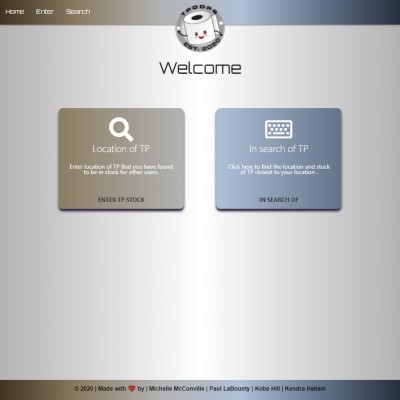
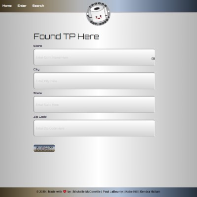
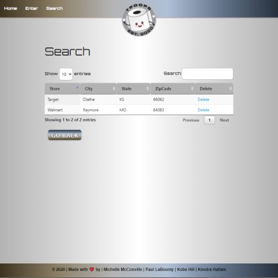

# [TPoops](https://mkkp-project2.herokuapp.com/) 🔗


## Description

A simple full stack Toilet 🚽 Paper Report & Finding App

| ***Home Page***                   | ***Input Page***                |
| --------------------------------- | ------------------------------- |
|      |  |
| ***Search Page***                 |
|  |

## Table of Contents ✨

* [Technology Used](#technology)
* [User Story](#us)
* [Repository](#repo)
* [Contributing](#contributing)
* [Tests](#tests)
* [Questions](#questions)
* [License](#license)

## Technology Used 🛠️ <a name="technology"></a>

```.
  HTML - CSS - JavaScript - Materialize
  Node - MySQL - Express - Sequelize - Handlebars - Heroku
```

## User Story 📖‍ <a name="us"></a>

```md
AS a toilet paper user
I WANT to see when toilet paper is in stock
SO THAT I can buy some before everyone else takes it all!
```

## Repository ⚙️ <a name="repo"></a>

https://github.com/MichelleMcConville/P2-tpoops

## Contributing 🤝 <a name="contributing"></a>

All contributions must be approved by owners

## Tests ✅ <a name="tests"></a>

There are currently no testing procedures for this application

## Questions ❓ <a name="questions"></a>

* 📧 If you have any questions please [**eMail**](mailto:dev.mchel@gmail.com) me
* :octocat: Check out more of our work on
  * [**Michelle's GitHub**](https://michellemcconville.github.io/08-updated-portfolio/portfolio.html)
  * [**Kendra's GitHub**](https://kjhallam.github.io/portfolio.html)
  * [**Kobe's GitHub**](https://github.com/Kobehill68)
  * [**Paul's GitHub**](https://github.com/Plabounty)

## License 📝 <a name="license"></a>

This project is **`Massachusetts Institute of Technology`** licensed

---

 Copyright ©️ 2021 🌻 Michelle McConville | Kendra Hallam | Kobe Hill | Paul LaBounty
